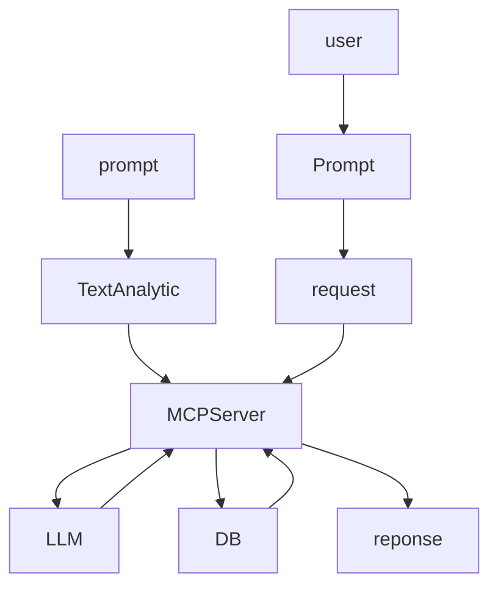

# MCP-Server-All

## Use Case 
- AI Coding Assistants
- Meeting Scheduling
- Document Generation
- Content Workflow Automation
- Developer Workflows
- Marketing Operations
- Personalized 
- Sending automated voice replies to Customers
- Event Scheduling


# Prompt

```python

prompt =""

````
> [!NOTE]
> Useful information that users should know, even when skimming content.

> [!TIP]
> Helpful advice for doing things better or more easily.

> [!IMPORTANT]
> Key information users need to know to achieve their goal.

> [!WARNING]
> Urgent info that needs immediate user attention to avoid problems.

> [!CAUTION]
> Advises about risks or negative outcomes of certain actions.
> 
Managing Coding https://github.com/mem0ai/mem0-mcp
