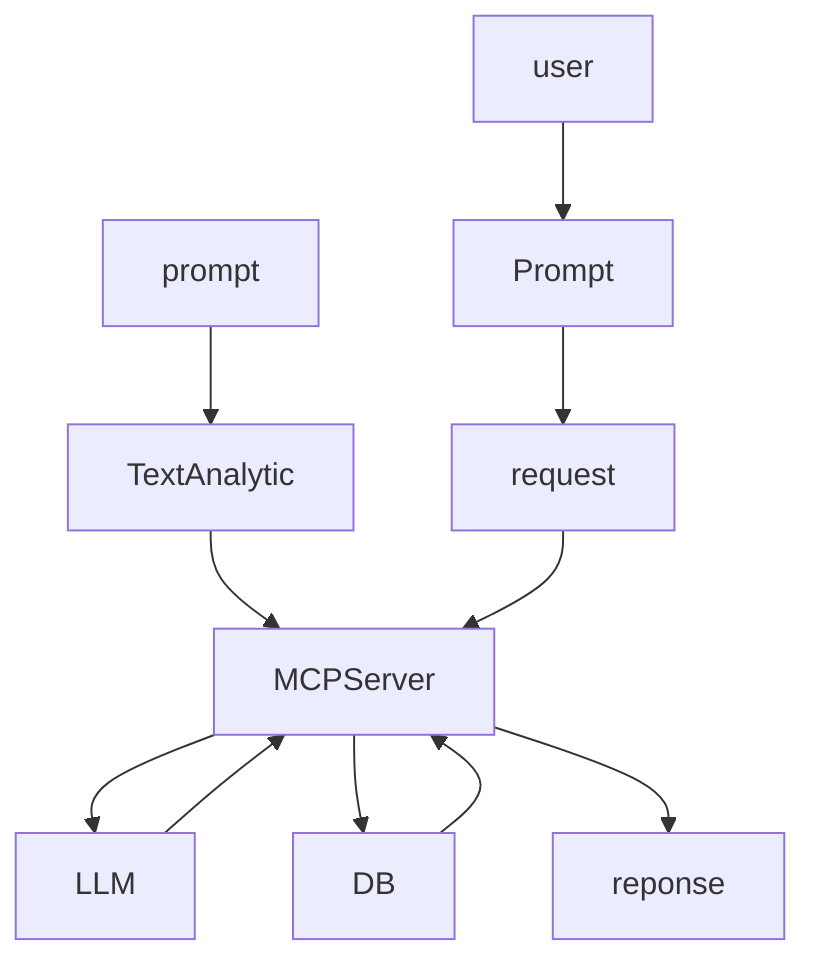

# MCP-Server-All

## Use Case 
- AI Coding Assistants
- Meeting Scheduling
- Document Generation
- Content Workflow Automation
- Developer Workflows
- Marketing Operations
- Personalized 
- Sending automated voice replies to Customers
- Event Scheduling




## installation 
```python
## Startt Installation python

pip install llm 
pipx install llm
uv tool install llm
brew install llm
```

## Upgrade version
```python
pip install -U llm
pipx upgrade llm
uv tool upgrade llm
brew upgrade llm
llm install -U llm
```

## Using uvx
```python
export OPENAI_API_KEY='sx-...'
uvx llm 'test uvx
uvx --with llm-anthropic llm -m claude-3.5-haiku'

uvx llm keys set openai

```
## llm command
```python
llm [command]
[generate]
[chat]
[model]

```

## Question


## Prompt

```python

prompt =""

````


## Ask


> [!NOTE]
> Useful information that users should know, even when skimming content.

> [!TIP]
> Helpful advice for doing things better or more easily.

> [!IMPORTANT]
> Key information users need to know to achieve their goal.

> [!WARNING]
> Urgent info that needs immediate user attention to avoid problems.

> [!CAUTION]
> Advises about risks or negative outcomes of certain actions.
> 

