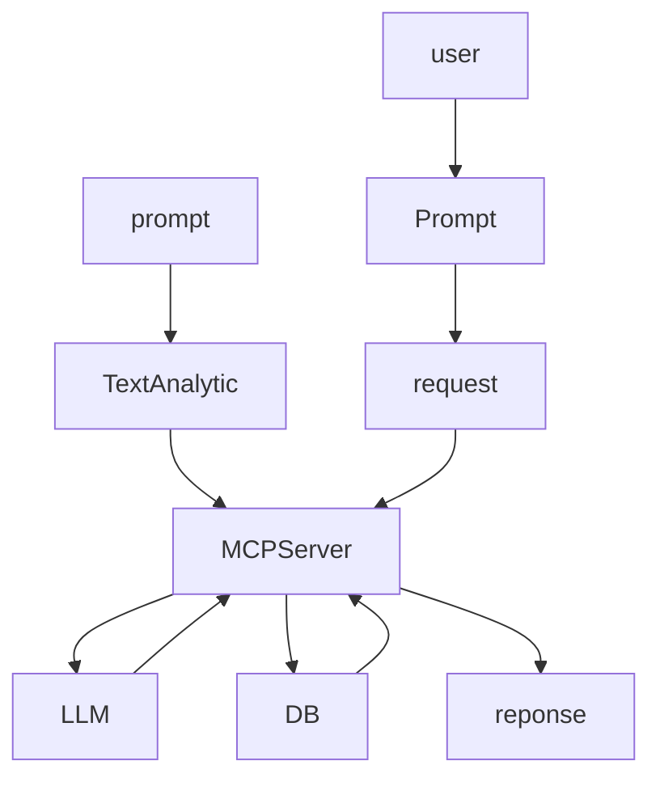

# MCP-Server-All

## Use Case 
- AI Coding Assistants
- Meeting Scheduling
- Document Generation
- Content Workflow Automation
- Developer Workflows
- Marketing Operations
- Personalized 
- Sending automated voice replies to Customers
- Event Scheduling

# รายละเอียดแต่ละหัวข้อ

## 1. AI Coding Assistants

ผู้ช่วยเขียนโปรแกรมด้วย AI ที่ช่วยนักพัฒนาเขียน แก้ไข และตรวจสอบโค้ดได้รวดเร็วขึ้น โดยสามารถทำงานร่วมกับ IDE หรือเครื่องมือพัฒนาโปรแกรมต่าง ๆ

**ความสามารถหลัก**

* สร้างโค้ดจากคำอธิบายภาษาธรรมชาติ
* อธิบายโค้ดที่ซับซ้อน
* ตรวจหาและแก้ไข Bugs
* Refactor และปรับปรุงโครงสร้างโค้ด
* สร้าง Unit Tests
* ช่วยเขียน Documentation
* แปลงโค้ดจากภาษาโปรแกรมหนึ่งไปอีกภาษา
* ช่วย Review Code และเสนอแนวทางปรับปรุง

**ตัวอย่างการใช้งาน**

> Developer พิมพ์ว่า “สร้าง REST API สำหรับระบบสมัครสมาชิกด้วย Node.js” → AI สร้างโครงสร้าง API, validation, authentication และ test ให้เบื้องต้น

---

## 2. Meeting Scheduling

ระบบ AI สำหรับจัดการและนัดหมายการประชุมโดยอัตโนมัติ ลดการคุยไปมาระหว่างผู้เข้าร่วมเพื่อหาช่วงเวลาที่ทุกคนว่าง

**ความสามารถหลัก**

* ตรวจสอบ Calendar ของผู้เข้าร่วม
* ค้นหาช่วงเวลาที่เหมาะสม
* ส่งคำเชิญประชุม
* จัดการการเลื่อนหรือยกเลิกประชุม
* ส่ง Reminder ก่อนประชุม
* จัดการ Time Zone ของผู้เข้าร่วม
* เชื่อมต่อกับ Video Conference เช่น Zoom หรือ Google Meet

**ตัวอย่างการใช้งาน**

> ลูกค้าส่งอีเมลว่า “สะดวกคุยสัปดาห์หน้า” → AI ตรวจสอบ Calendar ของทั้งสองฝ่าย → เลือกเวลาที่เหมาะสม → ส่ง Meeting Invite ให้อัตโนมัติ

---

## 3. Document Generation

การใช้ AI สร้างเอกสารจากข้อมูลหรือคำสั่งที่กำหนด โดยลดเวลาที่มนุษย์ต้องเขียนเอกสารด้วยตัวเอง

**ความสามารถหลัก**

* สร้างเอกสารจาก Template
* สร้างรายงานจากข้อมูล
* สร้าง Proposal
* สร้างสัญญาหรือเอกสารทางธุรกิจตาม Template
* สร้าง SOP และคู่มือ
* สรุปข้อมูลจำนวนมากเป็นเอกสาร
* ปรับรูปแบบและ Tone of Voice
* แปลงข้อมูลจาก Spreadsheet หรือ Database เป็นเอกสาร

**ตัวอย่างการใช้งาน**

> ระบบดึงข้อมูลยอดขายประจำเดือน → AI วิเคราะห์ข้อมูล → สร้าง Monthly Sales Report พร้อม Executive Summary และ Key Insights

---

## 4. Content Workflow Automation

ระบบที่ช่วยทำให้กระบวนการสร้างและเผยแพร่ Content ตั้งแต่ต้นจนจบเป็นอัตโนมัติ

**Workflow ตัวอย่าง**

```text
Idea
  ↓
AI Research
  ↓
Content Generation
  ↓
Human Review
  ↓
Approval
  ↓
Publishing
  ↓
Distribution
  ↓
Performance Analysis
```

**ความสามารถหลัก**

* สร้าง Content Ideas
* Research หัวข้อ
* เขียนบทความหรือ Social Media Posts
* สร้าง Content หลายรูปแบบจากเนื้อหาเดียว
* ตรวจ Grammar และ Brand Guidelines
* ส่งให้ทีม Review
* ตั้งเวลาเผยแพร่
* กระจาย Content ไปหลายช่องทาง
* วิเคราะห์ Performance

**ตัวอย่างการใช้งาน**

> Blog Article 1 เรื่อง → AI แปลงเป็น LinkedIn Post, X Post, Newsletter และ Short Video Script โดยอัตโนมัติ

---

## 5. Developer Workflows

การใช้ AI และ Automation เพื่อจัดการกระบวนการทำงานของทีม Developer ตั้งแต่การรับ Task ไปจนถึง Deployment

**ความสามารถหลัก**

* สร้างและจัดการ Tickets
* วิเคราะห์และจัดลำดับความสำคัญของ Issues
* สร้าง Pull Request
* Code Review
* Generate Tests
* วิเคราะห์ CI/CD Failures
* Deployment Automation
* ตรวจสอบ Logs
* Incident Detection และ Response
* สร้าง Documentation จาก Codebase

**ตัวอย่าง Workflow**

```text
Customer reports bug
        ↓
AI วิเคราะห์ปัญหา
        ↓
สร้าง GitHub Issue
        ↓
สร้าง Code Fix
        ↓
สร้าง Pull Request
        ↓
Run Tests
        ↓
Code Review
        ↓
Deploy
```

จุดสำคัญคือ **AI Coding Assistant** เน้นการช่วย “เขียนโค้ด” ขณะที่ **Developer Workflows** เน้นการทำให้ “กระบวนการพัฒนาซอฟต์แวร์ทั้งหมด” ทำงานอัตโนมัติมากขึ้น

---

## 6. Marketing Operations

การใช้ AI และ Automation เพื่อจัดการงานด้าน Marketing ตั้งแต่การวางแผน Campaign ไปจนถึงการวิเคราะห์ผลลัพธ์

**ความสามารถหลัก**

* Lead Management
* Lead Scoring
* Customer Segmentation
* Email Marketing
* Campaign Automation
* CRM Updates
* Personalization
* Content Distribution
* Marketing Analytics
* Campaign Reporting
* Lead Routing ไปยัง Sales

**ตัวอย่าง Workflow**

```text
New Lead
   ↓
AI วิเคราะห์ Lead
   ↓
Lead Scoring
   ↓
แบ่งกลุ่มลูกค้า
   ↓
ส่ง Personalized Email
   ↓
ติดตาม Engagement
   ↓
Lead สนใจสูง
   ↓
ส่งต่อ Sales
```

ช่วยลดงาน Manual ของ Marketing Team และทำให้สามารถดูแล Lead จำนวนมากได้โดยไม่ต้องเพิ่มจำนวนพนักงานตามสัดส่วน

---

## 7. Personalized Automation

ระบบ Automation ที่ไม่ได้ส่งข้อความหรือทำงานเหมือนกันกับทุกคน แต่ใช้ข้อมูลของแต่ละบุคคลเพื่อสร้างประสบการณ์ที่แตกต่างกัน

**ข้อมูลที่สามารถนำมาใช้**

* ชื่อและข้อมูลพื้นฐาน
* ประวัติการซื้อ
* พฤติกรรมบนเว็บไซต์
* การเปิด Email
* สิ่งที่ลูกค้าสนใจ
* ประวัติการติดต่อ
* ตำแหน่งหรือ Segment
* Previous Interactions

**ตัวอย่าง**

ลูกค้า A สนใจสินค้า **Software Development**

→ ส่ง Content เกี่ยวกับ Developer Tools

ลูกค้า B สนใจ **Marketing**

→ ส่ง Content เกี่ยวกับ Marketing Automation

ลูกค้า C เคยทดลองใช้สินค้าแต่ยังไม่ซื้อ

→ ส่ง Follow-up ที่เหมาะกับสถานะของลูกค้า

แนวคิดสำคัญคือ

> **Right message + Right person + Right time**

---

## 8. Sending Automated Voice Replies to Customers

การใช้ AI Voice Agent เพื่อรับสาย พูดคุย และตอบกลับลูกค้าแบบอัตโนมัติ โดยไม่จำเป็นต้องมีพนักงานรับสายทุกครั้ง

**ความสามารถหลัก**

* รับสายโทรศัพท์
* เข้าใจคำพูดของลูกค้า
* ตอบคำถามเกี่ยวกับสินค้าและบริการ
* ตรวจสอบ Order หรือข้อมูลลูกค้า
* รับ Booking / Reservation
* สร้างหรืออัปเดต Ticket
* Qualify Leads
* โอนสายให้พนักงานเมื่อจำเป็น
* โทร Follow-up ลูกค้า
* ส่งข้อมูลสรุปหลังจบการสนทนา

**ตัวอย่าง Workflow**

```text
Customer calls
      ↓
AI รับสาย
      ↓
ระบุความต้องการ
      ↓
ค้นข้อมูลจากระบบ
      ↓
ตอบลูกค้า
      ↓
ดำเนินการตามคำขอ
      ↓
บันทึก Call Summary
      ↓
Update CRM
```

ตัวอย่างเช่น ลูกค้าถามว่า **“ออเดอร์ของฉันถึงไหนแล้ว?”**

AI สามารถตรวจสอบ Order Status จากระบบ แล้วตอบลูกค้าได้ทันที หากเป็นกรณีที่ซับซ้อนก็สามารถส่งต่อให้เจ้าหน้าที่ได้

---

## 9. Event Scheduling

ระบบสำหรับสร้างและจัดการ Event โดยใช้ Automation ลดงานในการประสานงานระหว่างผู้จัดและผู้เข้าร่วม

**ความสามารถหลัก**

* สร้าง Event
* กำหนดวัน เวลา และสถานที่
* สร้าง Registration Form
* ส่ง Invitation
* จัดการ RSVP
* ส่ง Reminder
* จัดการ Calendar
* ส่ง Confirmation
* จัดการ Waitlist
* ส่ง Follow-up หลัง Event
* สร้างรายงานผู้เข้าร่วม

**ตัวอย่าง Workflow**

```text
Create Event
    ↓
Generate Invitation
    ↓
Send to Participants
    ↓
Registration
    ↓
Confirmation
    ↓
Reminder
    ↓
Event
    ↓
Follow-up
    ↓
Feedback / Report
```

### สรุปภาพรวม

| หัวข้อ                          | เป้าหมายหลัก                              |
| ------------------------------- | ----------------------------------------- |
| **AI Coding Assistants**        | ช่วย Developer เขียนและแก้โค้ด            |
| **Meeting Scheduling**          | นัดหมายประชุมอัตโนมัติ                    |
| **Document Generation**         | สร้างเอกสารจากข้อมูลและ Template          |
| **Content Workflow Automation** | Automate กระบวนการสร้างและเผยแพร่ Content |
| **Developer Workflows**         | Automate กระบวนการพัฒนาซอฟต์แวร์          |
| **Marketing Operations**        | Automate งานและ Campaign ของ Marketing    |
| **Personalized Automation**     | สร้าง Automation ที่เหมาะกับแต่ละบุคคล    |
| **Automated Voice Replies**     | ให้ AI รับสายและตอบลูกค้า                 |
| **Event Scheduling**            | จัดการ Event และผู้เข้าร่วมแบบอัตโนมัติ   |



```mermaid
graph TD;
    user-->Prompt;
    prompt-->TextAnalytic;
    TextAnalytic-->MCPServer;
    Prompt-->request;
    request-->MCPServer;
    MCPServer-->LLM;
    MCPServer-->DB;
    DB-->MCPServer;
    LLM-->MCPServer;
    MCPServer-->reponse;
```

## installation 
```python
## Startt Installation python

pip install llm 
pipx install llm
uv tool install llm
brew install llm
```

## Upgrade version
```python
pip install -U llm
pipx upgrade llm
uv tool upgrade llm
brew upgrade llm
llm install -U llm
```

## Using uvx
```python
export OPENAI_API_KEY='sx-...'
uvx llm 'test uvx
uvx --with llm-anthropic llm -m claude-3.5-haiku'

uvx llm keys set openai

```
## llm command
```python
llm [command]
[generate]
[chat]
[model]
[setkey]
[install][models]

[--tools]
[--schemas]
[--schema-multi]
'data1','data2','data3',..,'datan'


```

## Question


## Prompt

```python

prompt =""

````


## Ask


> [!NOTE]
> Useful information that users should know, even when skimming content.

> [!TIP]
> Helpful advice for doing things better or more easily.

> [!IMPORTANT]
> Key information users need to know to achieve their goal.

> [!WARNING]
> Urgent info that needs immediate user attention to avoid problems.

> [!CAUTION]
> Advises about risks or negative outcomes of certain actions.
> 

